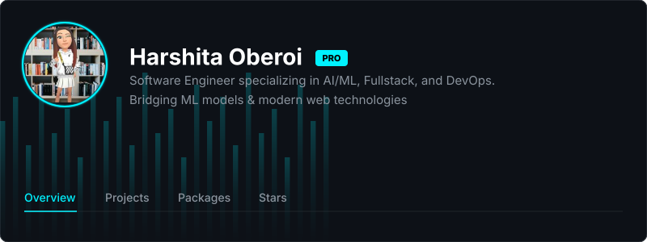
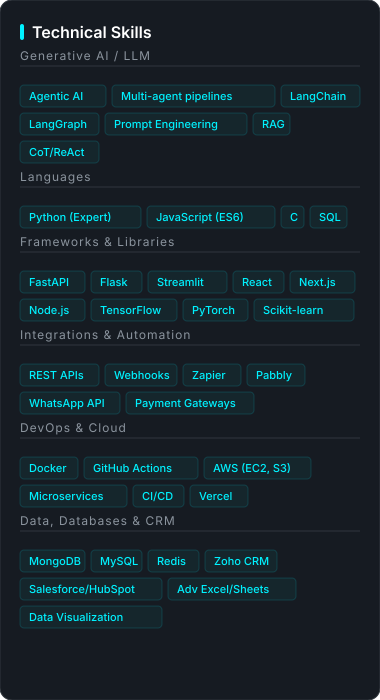
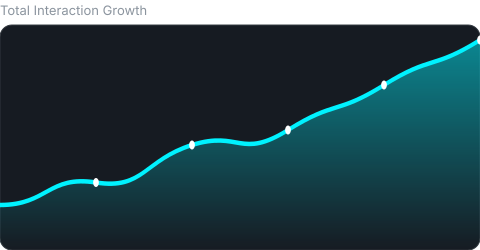
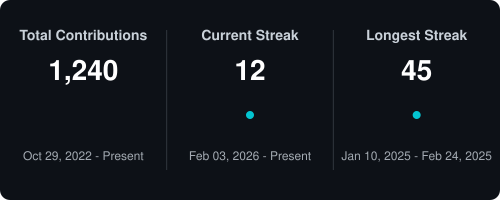
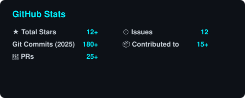
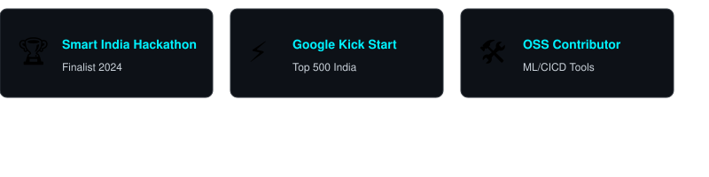
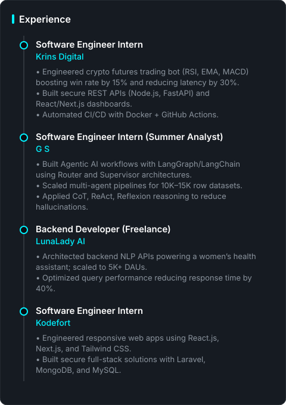

    

 

    <!-- Main Grid Simulation using Table -->
    <table width="100%" style="border: none;">
        <tr>
            <!-- Left Column: Connect, Wisdom, Education, Skills -->
            <td width="50%" valign="top" style="border: none;">
                <h2 style="border-bottom: 2px solid #00f2ff; padding-bottom: 8px;">Connect</h2>
                

                    
                    
                    
                    
                

                 
                <h2 style="border-bottom: 2px solid #00f2ff; padding-bottom: 8px;">Tech Wisdom</h2>
                
                 
                 
                <h2 style="border-bottom: 2px solid #00f2ff; padding-bottom: 8px;">Education</h2>
                
                 
                <h2 style="border-bottom: 2px solid #00f2ff; padding-bottom: 8px;">Technical Skills</h2>
                
            </td>
            <!-- Right Column: Analytics, Experience -->
            <td width="50%" valign="top" style="border: none;">
                <h2 style="border-bottom: 2px solid #00f2ff; padding-bottom: 8px;">Analytics & Data</h2>
                
                 
                
                 
                

                    
                    
                

                <!-- Using trophies.svg as per checking file existence -->
                
                 
                <h2 style="border-bottom: 2px solid #00f2ff; padding-bottom: 8px;">Experience</h2>
                
            </td>
        </tr>
    </table>

 

    
© Harshita Oberoi | Status: 🟢 Available for hire

